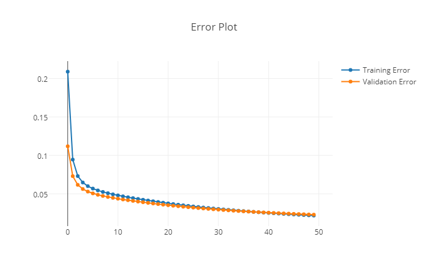
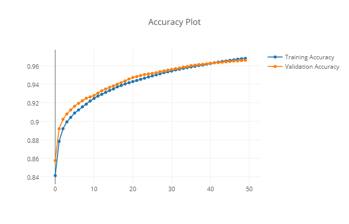

# Deep Learning Implementation
Implementation of deep learning algorithms in Python for self understanding.

### References:
* Goodfellow,Bengio, and Courville Deep Learning Book: http://www.deeplearningbook.org/
* MNielsen's free online deep learning book: http://neuralnetworksanddeeplearning.com/
* Implementation ideas from eriklindernoren ML from scratch: https://github.com/eriklindernoren/ML-From-Scratch

##### MLP with one hidden layer on the MNIST Dataset
```python
from deepnetwork import neural_net
from deepnetwork_layer import *
from mnist_loader import load_data_wrapper
from activation_functions import *
from learning_optimizers import *
from loss_functions import *
from util import *

training_data,validation_data,test_data = load_data_wrapper()

X,y = unwind_data_wrapper(training_data)
X_test,y_test = unwind_data_wrapper(test_data)
X_val,y_val = unwind_data_wrapper(validation_data)

n_features = 784
mnist_net = neural_net(input_features = n_features, optimizer = SGD(learning_rate = 0.01, batch_size = 64), loss_function = Cross_Entropy,validation_set = (X_val,y_val))
mnist_net.add_layer(Connected(n_neurons = 100))
mnist_net.add_layer(Activation(activation_function = RLU))
mnist_net.add_layer(Connected(n_neurons = 10))
mnist_net.add_layer(Activation(activation_function = Softmax))
mnist_net.summary()
mnist_net.fit(X,y,n_epochs = 50,validation_test = True)

training_errors,training_accuracy = mnist_net.errors['training'],mnist_net.accuracy['training']
validation_errors,validation_accuracy = mnist_net.errors['validation'],mnist_net.accuracy['validation']

labels = ['Training Error','Validation Error']
plotter(range(len(training_errors)),[training_errors,validation_errors],labels = labels,title = 'Error Plot')

labels = ['Training Accuracy','Validation Accuracy']
plotter(range(len(training_errors)),[training_accuracy,validation_accuracy],labels = labels,title = 'Accuracy Plot')

loss,accuracy = mnist_net.batch_test(X_test,y_test)
print 'Accuracy:',accuracy
```
    $mnist_net.py
    +---------------+
    | Model Summary |
    +---------------+
    +------------+----------------------+--------------+
    | Layer Type | Number of Parameters | Output Shape |
    +------------+----------------------+--------------+
    | Connected  | 78500                | (100,)       |
    | RLU        | 0                    | (100,)       |
    | Connected  | 1010                 | (10,)        |
    | Softmax    | 0                    | (10,)        |
    +------------+----------------------+--------------+
    Number of Total Parameters: 79510 
    
    Accuracy: 0.9628




